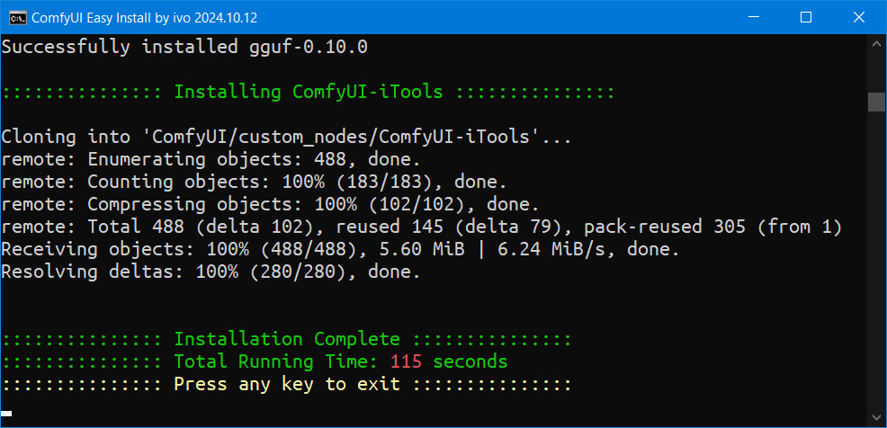

# ComfyUI-Easy-Install

> **Pixaroma's** Team Edition. [Discord Channel](https://discord.com/invite/gggpkVgBf3)

## General Information
ComfyUI-Easy-Install provides a portable Windows version of ComfyUI with basic nodes included.  
It’s ideal for safely testing ComfyUI nodes or quickly setting up a fresh instance.  
Installation typically takes 1-2 minutes, depending on your download speed.

## What the Installer Does
* Installs or updates **7-Zip** (if necessary)
* Installs or updates **Git** (if necessary)
* Installs **ComfyUI portable**
* Installs **ComfyUI-Manager**
* Installs **ComfyUI-Crystools**
* Installs **rgthree-comfy**
* Installs **ComfyUI-Easy-Use**
* Installs **was-node-suite-comfyui**
* Installs **ComfyUI-GGUF**
* Installs **comfyui_controlnet_aux**
* Installs **ControlAltAI-Nodes**
* Installs **ComfyUI-iTools**
* Installs **ComfyUI_Comfyroll_CustomNodes**
* Installs **comfyui-art-venture**
* Installs **comfyui-tensorops**
* Installs **ComfyUI_Searge_LLM**
* Installs **ComfyUI_Eagleshadow**
* Installs **ComfyUI-seamless-tiling**
* Installs **ComfyUI-Inspyrenet-Rembg**

## How to Use
- Extract [ComfyUI-Easy-Install](https://github.com/Tavris1/ComfyUI-Easy-Install/archive/refs/tags/0.1.0.zip) in a folder where ComfyUI will be installed and run '**ComfyUI-Easy-Install.bat**'.
  - *Optionally* put your '**extra_model_paths.yaml**', '**styles.json**' (was-node-suite) and/or **rgthree_config.json**
  next to the installer to be copied to '**ComfyUI**' folders.
- If another '**ComfyUI_windows_portable**' folder is found, the Installer will **stop** to avoid conflicts.
  - Simply relocate the Installer to a different folder and rerun it.
- After installation, you can **move** or **rename** the '**ComfyUI_windows_portable**' folder.

## Screenshots

